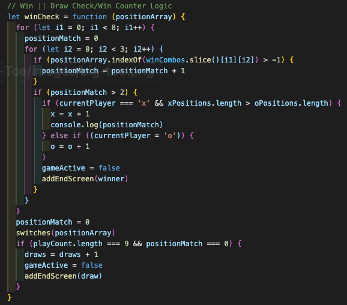

# Tick-Tac-Toe
### Created By: Sam'an Khaliq
(Deployed Site Below)

## Overview
Tick-Tac-Toe! Obviously, I got a little punny with the title and animation on this one. This project was my first attempt at a game engine; and the functions that might fuel it. I'm very proud of how this turned out, as this was only the 4th time I'd built a web page from blank to interactive. The experience as a whole helped me to solidify the basic principles of working with vanilla javascript. I'm also proud of myself for learning how to incorporate music into a web page on my own. This was one of the first coding skills that I ventured to learn on my own!

## My Favorite Code Block

  

My favorite code block is the logic that defines and checks for wins and draws. The main reason for this sentiment is that most of my classmates had a hard time figuring this logic out on their own, because of that, when we were presenting our code, my instructor noticed that no one else's win logic looked like mine. The thing I treasure most in this life is my unique perspective/way of thinking. I love that this aspect of myself had shone through so early in my journey as a software engineer!

## Final Words
Thank you so much for taking time out of your day to delve this deep into my portfolio, haha! Please, don't hesitate to connect with me on [LinkedIn](https://www.linkedin.com/in/saman-khaliq/) and hit my inbox for a chat. If you're interested, check out the gameplay on the web page I deployed with surge [here](http://tick-tac-toe.surge.sh/). Take a peek at my [portfolio](https://www.samankhaliq.com/) website if you want to see more of my projects, maybe check out some of my more complex work. Have a blessed day!
